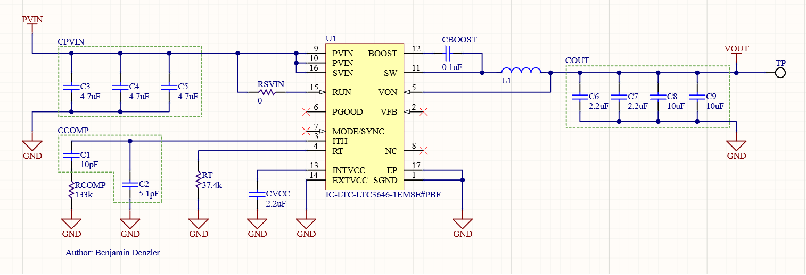
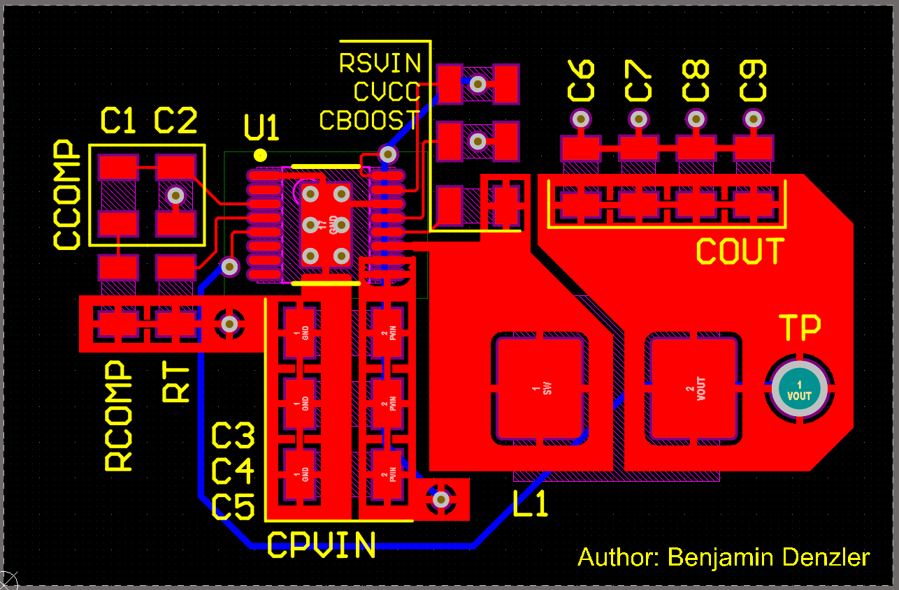
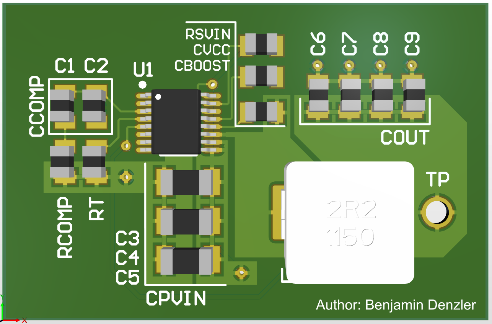
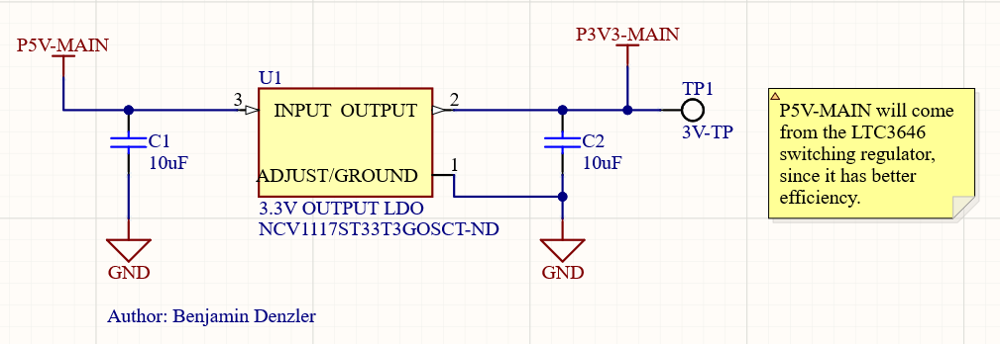
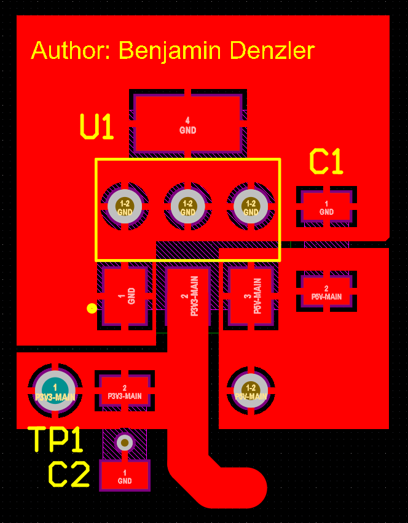
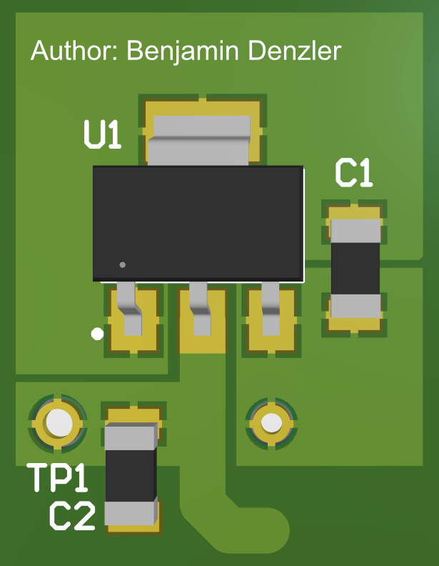
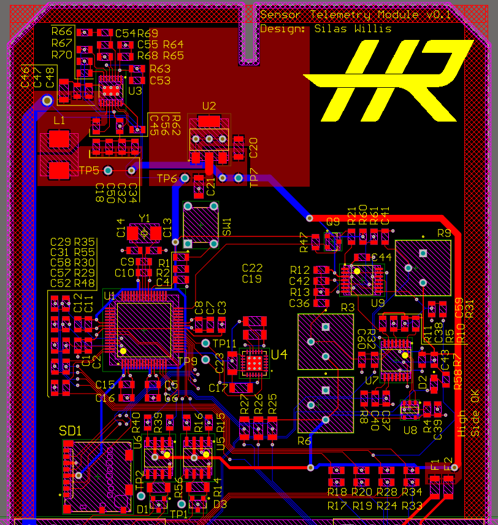
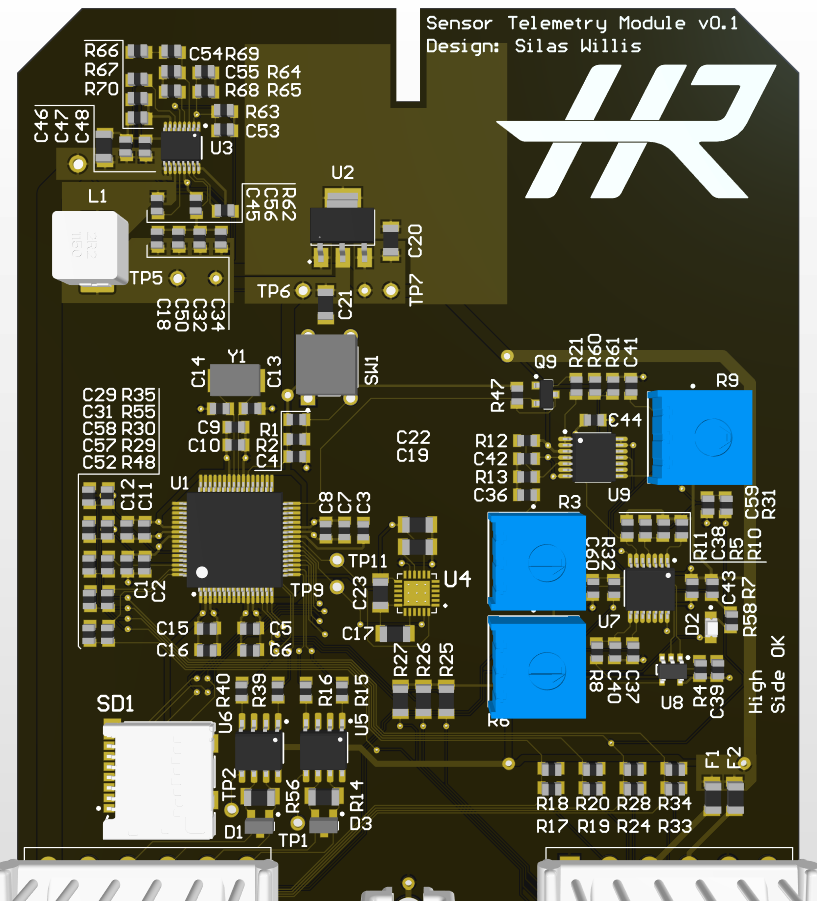

# PCB Power Supply

 Author: [Benjamin Denzler](https://github.com/ben-denzler)

 ## Project Description

This is a project I did for Highlander Racing, an FSAE club at UC Riverside. I made schematics and PCB layouts for a power supply that converts a 12V input to 5V and 3.3V outputs. After designing the power supply, I implemented it on one of the boards for the club's car: the Sensor Telemetry Module (STM)!

The power supply consists of two parts: an [LTC3646 step-down converter](https://www.analog.com/en/products/ltc3646.html#product-overview) converts 12V from the car battery to 5V, and an [NCV1117 linear voltage regulator](https://www.onsemi.com/products/power-management/linear-regulators-ldo/ncv1117) that converts 5V to 3.3V.

## LTC3646 step-down converter

I chose the LTC3646 to convert 12V to 5V because of its efficiency. The boards in our car are in small boxes, so they’re prone to overheating. The LTC3646 is a switching regulator, meaning heat output is minimized. The component is also AEC-Q100 qualified, meaning it’s appropriate for automotive use.

### Design considerations

* The suggested PCB layout given by the LTC3646's datasheet was used as a starting point.
* Space was left in between the LTC3646 and the inductor to reduce interference.
* Vias were placed below the LTC3646 to dissipate heat into the board's copper.
* The PCB layout and schematic were annotated to help other team members.

### Images

LTC3646 schematic:

LTC3646 PCB layout (2D view):

LTC3646 PCB layout (3D view):

## NCV1117 linear voltage regulator

I chose the NCV1117 to convert 5V to 3.3V because heat was less of a concern for this component. The small drop in voltage means less heat is produced, so it made sense to use a smaller, cheaper, and less efficient linear voltage regulator. This component is also AEC-Q100 qualified, so it can be used for automobiles.

### Design considerations

* Layout was made to easily connect to the output of our previous LTC3646 design.
* Design size was minimized to save space on our small boards.
* Vias were placed under the IC to help with heat dissipation into the board's copper.
* Copper pour for the IC is easily adjustable to fit different board shapes while still cooling sufficiently.

### Images

NCV1117 schematic document:

NCV1117 PCB layout (2D view):

NCV1117 PCB layout (3D view):

 ## Application

This power supply was used to power a board called the Sensor and Telemetry Module, and is seen below in the board's upper left corner. I made some modifications to my design to make it fit better on this board while staying cool. It takes 12V input from the battery, then delivers 5V to components like AND gates, comparators and transcievers, while delivering 3.3V to the board's microcontroller and SD card reader.

It takes a 12V input from the car’s battery, then delivers 5V to everything except a microcontroller and SD card reader. These two parts receive 3.3V.

STM board (2D view):

STM board (3D view):

